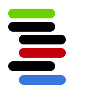

# TreeSQL



A proof of concept of a database which:
- Is relational (has tables with typed columns and foreign keys)
- Has a tree-structured query language
- Returns tree-structured results
- Can push live updates to those result trees

Currently uses [BoltDB](https://github.com/boltdb/bolt) as a storage layer.

[Docker Hub](https://hub.docker.com/r/vilterp/treesql/)

## Syntax

```sql
MANY blog_posts {
  id,
  title,
  body,
  comments: MANY comments {
    id,
    author: ONE users {
      name
    },
    body
  }
}
```

## Example

```
localhost:9000> MANY blog_posts { id, title, body, comments: MANY comments { id, author: ONE users { name }, body } }
[
  {
    "id": "0",
    "title": "inserting stuff?",
    "body": "idk maybe it will work",
    "comments": [
      {
        "id": "0",
        "author": {
          "name": "Pete"
        },
        "body": "fa la la la la comment"
      }
    ]
  },
  {
    "id": "11",
    "title": "whooo",
    "body": "k seem to have writes",
    "comments": [
      {
        "id": "44",
        "author": {
          "name": "Pete"
        },
        "body": "whaddup"
      }
    ]
  }
]
localhost:9000>
```

## Requirements

Use [the docker version](https://hub.docker.com/r/vilterp/treesql/), or:

- Go 1.10
- Node 6.9 & NPM 3.10
- [`godep`](https://github.com/tools/godep) (install with `go get github.com/tools/godep`)

## Installation

Use [the docker version](https://hub.docker.com/r/vilterp/treesql/) or:

- ```go get github.com/vilterp/treesql```
- ```cd $GOPATH/src/github.com/vilterp/treesql```
- ```$ make deps```
- ```$ make```

## Usage

`cd $GOPATH/src/github.com/vilterp/treesql`, then:

Start the server:

```
$ make start
```

Browse to http://localhost:9000/ and type in queries in the Web UI; e.g.:

```
many blog_posts { title, comments: many comments { body } } live
```

More examples live in `test_script.treesql`.
